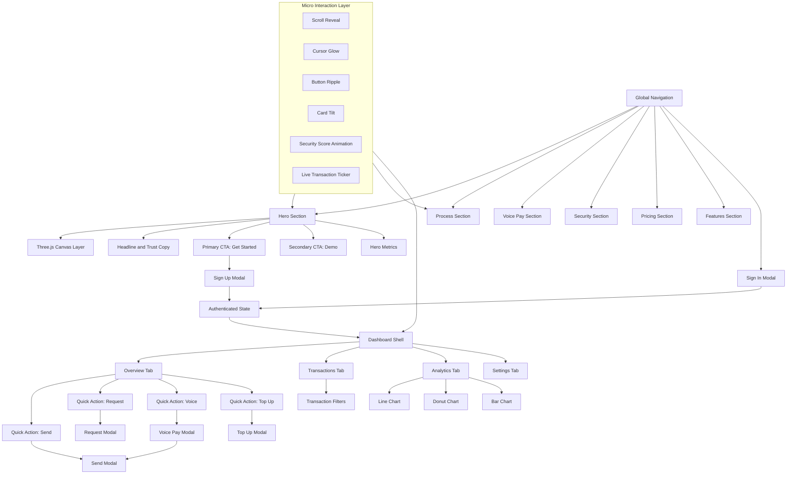

# SecurePay Website

A production-style frontend for a high-trust payments experience with cinematic 3D hero visuals, guided conversion flows, and an embedded operational dashboard.

This implementation preserves the original UI/UX exactly while running inside a React + Vite shell.

## Product Snapshot

SecurePay is designed around one principle: reduce cognitive load in financial actions.

- Primary users: growth teams, operations teams, and SMB finance owners.
- Core intent: fast trust-building on landing, instant action via modal workflows, and immediate value proof in dashboard views.
- Experience mode: animation-first, data-assisted, and interaction-rich.

## Top Features

1. Full 3D Hero Scene
- Real-time Three.js composition with layered cards, particles, glow systems, torii, and orbital geometry.
- Mouse-reactive camera and lighting to increase perceived depth and premium brand feel.

2. Conversion-Ready Auth + Action Modals
- Sign in and sign up entry points with direct validation.
- Action modals for send, request, voice pay, and top up.

3. Voice-Triggered Payment UX
- Browser speech capture for command-like transfer autofill behavior.
- Confirmation-state transitions to reduce ambiguity in voice interactions.

4. Data-Rich Dashboard
- Overview, transactions, analytics, and settings tabs.
- Chart.js-powered trend and category visualizations.

5. Premium Interaction Layer
- Scroll reveal, cursor glow, button ripple, tilt dynamics, animated counters, ticker loops, and adaptive nav behavior.

## Engineering Model

- Runtime shell: React + Vite
- UI source of truth: legacy homepage markup and style system
- Interaction source of truth: legacy inline script + legacy main script
- Libraries: Three.js, Chart.js, Web Speech API, IntersectionObserver

### Integration Strategy

The React layer intentionally acts as an orchestration boundary, not a redesign layer.

- React mounts the preserved homepage document content.
- Legacy scripts execute in strict sequence.
- External dependencies load before dependent inline logic.
- Result: exact visual parity with modern bundling/deployment compatibility.

## Implementation Logic by UI Intent

### Landing and Hero Logic

| Function | Domain | UI Consideration | User Impact |
|---|---|---|---|
| addOrb | 3D scene | Soft luminous volume around focal planes | Signals premium, high-trust visual quality |
| addTorus | 3D scene | Circular motion layers around payment card cluster | Reinforces flow and motion continuity |
| render | 3D scene | Central animation loop controls camera drift, pulses, and object motion | Keeps hero alive without manual interaction |
| animateCounter | Metrics | Eased numeric rise instead of instant value dump | Improves readability and perceived momentum |
| runCounters | Metrics | Starts grouped metric animation only when visible | Avoids wasted motion off-screen |

### Navigation and Discoverability Logic

| Function | Domain | UI Consideration | User Impact |
|---|---|---|---|
| toggle | Mobile nav | Explicit open-close state with outside-click safety | Predictable mobile navigation behavior |
| wireSignupLinks | Conversion routing | Any CTA with signup class maps to a single action path | Consistent onboarding entry behavior |
| applyTilt | Interaction depth | Card perspective tracks cursor position | Improves affordance and engagement |
| resetTilt | Interaction depth | Smooth return to neutral state | Prevents jarring layout feel |
| attachTilt | Interaction depth | Shared pattern attachment across card groups | Uniform interaction language |

### Transaction Experience Logic

| Function | Domain | UI Consideration | User Impact |
|---|---|---|---|
| showToast | Feedback | Immediate compact status notifications | Reduces uncertainty after actions |
| openSendModal | Flow launch | Shortest path to transfer action | Faster task completion |
| validateEmail | Auth quality | Early format-level validation | Fewer failed submissions |
| enterDashboard | Post-auth routing | Single state jump from auth to workspace | Clear progression from marketing to product |
| initWeekChart | Dashboard | Lightweight first chart initialization | Fast perceived analytics load |
| initCharts | Dashboard | Lazy graph initialization per tab demand | Performance-safe data visualization |

### Realtime/Ticker and Micro-Interaction Logic

| Function | Domain | UI Consideration | User Impact |
|---|---|---|---|
| makeItems | Live feed | Controlled synthetic transaction stream generation | Keeps activity context visible |
| renderTicker | Live feed | Seamless loop rendering with adaptive duration | Natural, non-jumpy motion |
| addRipple | CTA feedback | Point-of-click ripple confirmation | Better interaction acknowledgment |
| animateVal | Counter detail | Number interpolation with precision handling | Maintains value clarity across integer/decimal metrics |

## UI Wireframe and Interaction Topology

## Design-to-Code Principles Used

1. Visual hierarchy first
- Bold hero typography and progressive disclosure sections minimize first-visit confusion.

2. Action certainty
- Every transactional intent receives explicit feedback (modal state, status text, or toast).

3. Motion with purpose
- Animations are tied to orientation, trust signaling, and click confidence, not decoration alone.

4. Performance-aware richness
- Observer-gated effects and tab-based chart initialization reduce unnecessary work.

## Runbook

- Development: npm run dev
- Production build: npm run build
- Preview build: npm run preview

## Current Status

- Exact original website preserved in React runtime.
- Hero Three.js dependency ordering fixed for deterministic rendering.
- UI parity maintained intentionally (no redesign drift).

## Suggested Next Industry Upgrade

1. Add typed event contracts for modal actions and dashboard mutations.
2. Introduce lightweight RUM hooks for Core Web Vitals and modal funnel completion.
3. Move interaction modules into domain folders (hero, nav, dashboard, commerce) for maintainability.
